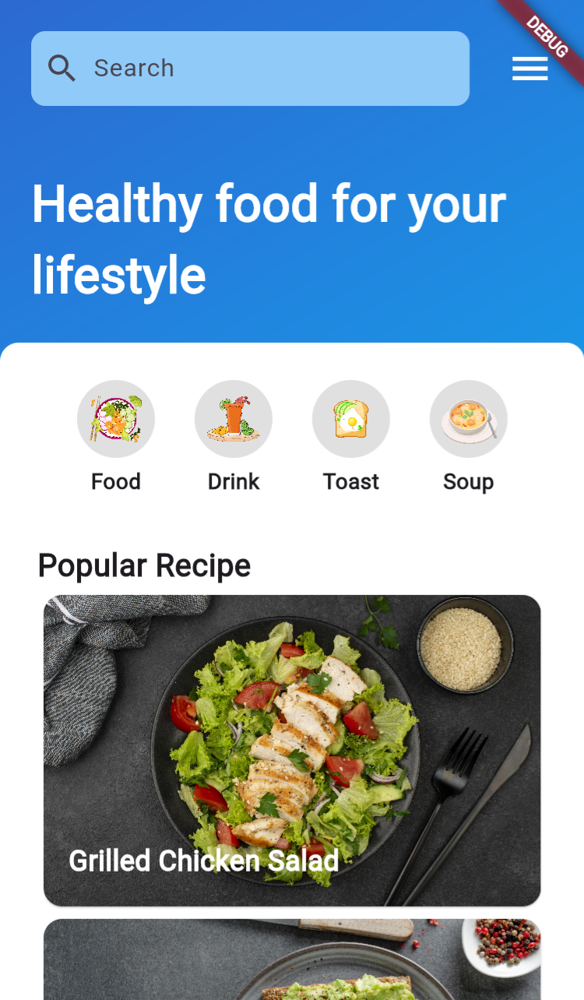
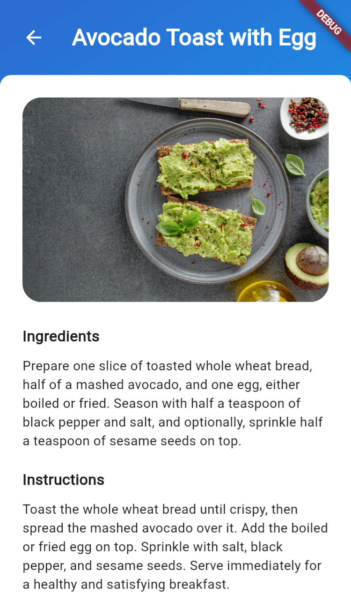

# HealthyBites

HealthyBites adalah aplikasi mobile berbasis Flutter yang menyediakan berbagai resep makanan sehat. Aplikasi ini memiliki fitur pencarian resep, kategori makanan, serta detail resep yang lengkap.

## 📌 Fitur Utama

- **Tampilan Menarik** dengan desain UI modern dan responsif.
- **Pencarian Resep** untuk menemukan makanan sehat favorit Anda.
- **Kategori Resep** seperti Makanan, Minuman, Roti, dan Sup.
- **Detail Resep** yang menampilkan bahan dan langkah-langkah pembuatan.
- **Gambar Resep** yang memperjelas tampilan makanan.

## 🛠️ Teknologi yang Digunakan

- **Flutter** (Dart)
- **Material Design**
- **Provider** (untuk manajemen state)
- **Asset Image** (untuk menampilkan gambar resep)

## 🚀 Cara Menjalankan

1. Pastikan Anda sudah menginstal **Flutter** di perangkat Anda.
2. Clone repositori ini:
   ```bash
   git clone https://github.com/username/healthybites.git
   ```
3. Masuk ke direktori proyek:
   ```bash
    cd healthybites
   ```
4. Jalankan perintah berikut untuk menginstal dependensi:
   ```bash
   flutter pub get
   ```
5. Jalankan aplikasi di emulator atau perangkat fisik:
   ```bash
   flutter run
   ```

## 📱 Tampilan Aplikasi

### Main Screen



### Detail Screen


